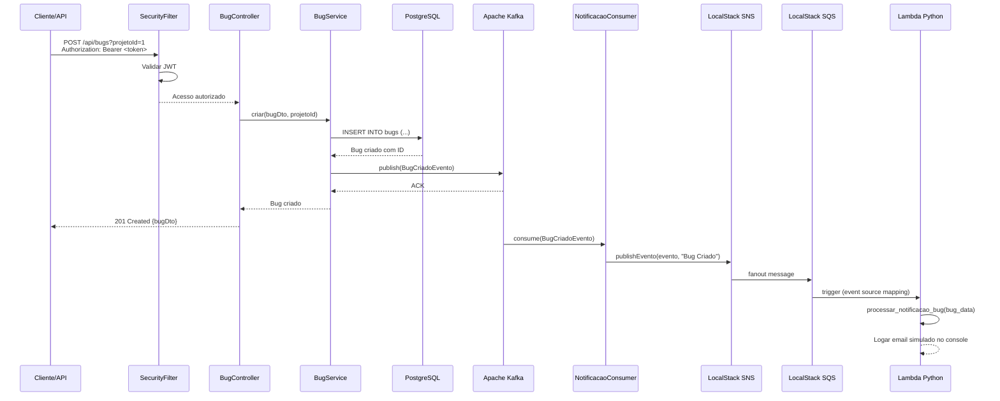

<div align="center">

<h1>Scizor Tracker</h1>

<h3>Sistema de rastreamento e gerenciamento de bugs com arquitetura event-driven</h3>


</div>

<p align="center">
  <a href="#funcionalidades">Funcionalidades</a> •
  <a href="#arquitetura">Arquitetura</a> •
  <a href="#documentacao">Documentação</a> •
  <a href="#como-rodar">Como rodar</a> •
  <a href="#stack-tecnico">Stack Técnico</a> •
  <a href="#observabilidade">Observabilidade</a> •
  <a href="#futuras-melhorias">Futuras melhorias</a> •
  <a href="#creditos">Créditos</a>
</p>

---

## Funcionalidades

### Visão Geral

O **Scizor Tracker** é um sistema completo de rastreamento de bugs construído com **Spring Boot 3.4.1**, integrando arquitetura event-driven e notificações serverless:

- **API RESTful** com autenticação JWT e controle de acesso baseado em roles (USER/ADMIN)
- **Persistência relacional** com PostgreSQL + JPA/Hibernate
- **Mensageria assíncrona** com Apache Kafka para desacoplamento de serviços
- **Notificações serverless** com LocalStack (SNS → SQS → Lambda Python) para emails simulados
- **Testes robustos**: Unitários (Mockito/JUnit 5) + Integração (Testcontainers) com **70%+ de cobertura** via JaCoCo
- **Observabilidade nativa**: Spring Boot Actuator + Prometheus + Grafana com dashboards pré-configurados
- **Documentação OpenAPI 3.0**: Swagger UI interativo com exemplos completos
- **Ambiente local completo**: Docker Compose orquestrando 8 serviços

---

### Gestão de Bugs

- Endpoints: listar (paginado), buscar por ID, criar, atualizar, deletar, atualizar status, atribuir/remover responsável
- CRUD completo de bugs com validações de negócio e regras de transição de status
- Status: `ABERTO` → `EM_ANDAMENTO` → `RESOLVIDO` → `FECHADO` (ou `REABERTO`)
- Prioridades: `BAIXA`, `MEDIA`, `ALTA`, `CRITICA`
- Busca avançada: por projeto, status, prioridade, responsável, termo livre, sem responsável
- Atribuição/remoção de responsáveis com validação de existência
- Paginação completa em todos os endpoints de listagem

### Gestão de Projetos

- Endpoints: listar (paginado), buscar por ID, buscar por nome, criar, atualizar, deletar
- CRUD completo de projetos de software
- Associação de bugs a projetos (relacionamento One-to-Many)
- Busca textual parcial e case-insensitive no nome do projeto
- Deleção em cascata (ao deletar projeto, todos os bugs são removidos)

### Sistema de Comentários

- Endpoints: listar (paginado), buscar por ID, buscar por bug, buscar por usuário, criar, atualizar, deletar
- Adicionar comentários aos bugs com rastreamento de autor e timestamp
- Busca de comentários por bug (ordenação cronológica) e por usuário
- Suporte a texto formatado (markdown-ready)
- Atualização de texto e deleção permanente

### Gestão de Usuários

- Endpoints: listar (paginado), buscar por ID, buscar por email, criar (público), atualizar, deletar
- Cadastro público de usuários (não requer autenticação)
- Senhas criptografadas com **BCrypt** (12 rounds)
- Email único (validação de duplicidade)
- Controle de acesso com roles: `USER` e `ADMIN`
- Ao deletar usuário, bugs atribuídos têm responsável removido automaticamente

### Autenticação e Autorização

- Endpoints públicos: `/api/autenticar/login`, `/api/senha/solicitar-redefinicao`, `/api/senha/redefinir`
- **JWT (JSON Web Token)** com Auth0 java-jwt library
- Token expira em 2 horas (configurável via `api.security.token.secret`)
- Endpoints protegidos por role (`@PreAuthorize("hasRole('ADMIN')")`)
- Sistema de recuperação de senha com token temporário (validade 1 hora)
- Notificação por email via Kafka → SNS → Lambda ao solicitar redefinição
- Credenciais de teste: `admin@scizor.com/admin123` (ADMIN) ou `joao.silva@example.com/senha123` (USER)

### Mensageria Event-Driven (Apache Kafka)

- **Tópicos**: `bug.criado`, `bug.status.alterado`, `bug.responsavel.atribuido`, `comentario.adicionado`, `bug.critico`, `senha.redefinicao.solicitada`
- Publicação de eventos assíncronos após persistência no banco
- Consumers escutam eventos e publicam no SNS (LocalStack)
- Kafka UI para monitoramento de tópicos e consumidores em tempo real

### Notificações Serverless (LocalStack)

- **Arquitetura**: Kafka → NotificacaoConsumer → SNS → SQS → Lambda (Python 3.11) → Logs simulados
- Lambda detecta tipo de evento automaticamente (bug vs redefinição de senha)
- Emails simulados aparecem nos logs do LocalStack (desenvolvimento local)
- Lambda processa mensagens em batch (até 10 por invocação)
- Preparado para migração para AWS real (SES para envio de emails reais)

---

## Arquitetura

### Fluxo Completo: Criar Bug e Notificar



### Componentes e Portas

| Serviço | Porta | Descrição |
|---------|-------|-----------|
| **Spring Boot Application** | 8080 | API REST com autenticação JWT |
| **PostgreSQL** | 5432 | Banco relacional com seed data |
| **Zookeeper** | 2181 | Coordenação do Kafka |
| **Apache Kafka** | 9092 | Message broker event-driven |
| **Kafka UI** | 8090 | Interface web para monitoramento |
| **LocalStack** | 4566 | Simulação AWS (SNS, SQS, Lambda, SES) |
| **Prometheus** | 9090 | Coleta de métricas |
| **Grafana** | 3000 | Dashboards de observabilidade |

### Arquitetura de Notificações

```mermaid
graph LR
    A[Spring Boot] -->|Publica Evento| B[Apache Kafka]
    B -->|Consome| C[NotificacaoConsumer]
    C -->|Publica| D[LocalStack SNS]
    D -->|Fanout| E[LocalStack SQS]
    E -->|Trigger| F[Lambda Python 3.11]
    F -->|Detecta Tipo| G{Evento?}
    G -->|bugId presente| H[Notificação Bug]
    G -->|token presente| I[Redefinição Senha]
    H -->|Loga| J[Console LocalStack]
    I -->|Loga| J
    
    style A fill:#6DB33F
    style B fill:#231F20
    style C fill:#6DB33F
    style D fill:#FF9900
    style E fill:#FF9900
    style F fill:#3776AB
    style J fill:#E6522C
```



---

## Documentação

Todos os endpoints estão documentados via **Swagger/OpenAPI 3.0** com descrições detalhadas, exemplos e códigos de resposta.

| Recurso | URL |
|---------|-----|
| **Swagger UI** | http://localhost:8080/swagger-ui.html |
| **Health Check** | http://localhost:8080/actuator/health |
| **Prometheus Metrics** | http://localhost:8080/actuator/prometheus |
| **Kafka UI** | http://localhost:8090 |
| **Grafana** | http://localhost:3000 (user: `admin` / password: `admin`) |
| **Prometheus** | http://localhost:9090 |

A coleção **Postman** está disponível em `Scizor-Tracker.postman_collection.json` para testes rápidos dos endpoints com variáveis de ambiente pré-configuradas.

---

## Como rodar

### Pré-requisitos

- [Docker](https://docs.docker.com/get-started/get-docker/) e Docker Compose (v2.0+)
- Espaço em disco: ~3GB para imagens Docker
- Portas livres: 8080, 5432, 9092, 2181, 8090, 4566, 9090, 3000

### Passos

1. Clone o repositório:

```bash
git clone https://github.com/paulooosf/scizor-tracker.git
cd scizor-tracker
```

2. Inicie todos os serviços (PostgreSQL + Kafka + LocalStack + Prometheus + Grafana + App):

```bash
docker compose up --build
```

3. Aguarde a inicialização (~60-90 segundos). Em outro terminal, verifique o status:

```bash
docker compose ps
```

Todos os serviços devem estar com status `Up` ou `healthy`.

4. Acesse os dashboards:

   - **Swagger API Docs**: http://localhost:8080/swagger-ui.html
   - **Health Check**: http://localhost:8080/actuator/health
   - **Kafka UI**: http://localhost:8090
   - **Grafana**: http://localhost:3000 (admin/admin)
   - **Prometheus**: http://localhost:9090

5. **Credenciais de teste** (criadas automaticamente via `data.sql`):

```
ADMIN: admin@scizor.com / admin123
USER:  joao.silva@example.com / senha123
```

6. **Teste rápido via Postman**:
   - Importe a coleção `Scizor-Tracker.postman_collection.json`
   - Collection já vem com variáveis de ambiente pré-configuradas
   - Endpoints organizados por módulo (Autenticação, Bugs, Projetos, Comentários, Usuários, Senha)

7. **Testar notificações**:
   - Crie um bug via API
   - Veja evento publicado no Kafka UI: http://localhost:8090
   - Veja logs da Lambda processando: `docker logs scizor-localstack --tail 100 | Select-String -Pattern "EMAIL SIMULADO"`

8. Para parar os serviços:

```bash
docker compose down
```

Para limpar volumes (apaga dados do banco):

```bash
docker compose down -v
```

---

## Stack Técnico

| Componente | Tecnologia | Versão |
|-----------|-----------|--------|
| Linguagem | Java | 21 |
| Framework Web | Spring Boot | 3.4.1 |
| Persistência | Spring Data JPA | 3.4.1 |
| Segurança | Spring Security + JWT | 6.4.2 |
| JWT Library | Auth0 java-jwt | 4.4.0 |
| Documentação API | Springdoc OpenAPI | 2.7.0 |
| Banco Relacional | PostgreSQL | 15-alpine |
| Message Broker | Apache Kafka | 7.5.0 (Confluent) |
| Kafka UI | Provectus Kafka UI | latest |
| Lambda Runtime | Python | 3.11 |
| AWS Simulation | LocalStack | 3.0 |
| Monitoramento | Micrometer + Prometheus | 1.14.2 |
| Dashboards | Grafana | 10.2.2 |
| Build | Maven | 3.9+ |
| Containerização | Docker | 24.0+ |
| Orquestração Local | Docker Compose | v3.8 |
| Testes Unitários | JUnit 5 + Mockito | 5.10+ |
| Testes Integração | Testcontainers + PostgreSQL | 1.19+ |
| Cobertura | JaCoCo (70%+ obrigatório) | 0.8.11 |

---

## Observabilidade

### Spring Boot Actuator

- **Health checks** detalhados: `/actuator/health`
- Endpoints disponíveis: health, info, metrics, prometheus
- Probes Kubernetes-ready (liveness/readiness)

### Prometheus Metrics

- Endpoint: http://localhost:8080/actuator/prometheus
- Métricas coletadas: HTTP requests, JVM memory, CPU, threads, database connections
- Custom tags: `application=scizor-tracker`, `environment=local`
- Scrape interval: 15 segundos (configurável em `infra/prometheus.yml`)

### Grafana Dashboards

- URL: http://localhost:3000
- Credenciais: `admin` / `admin`
- Datasource Prometheus pré-configurado
- Dashboards sugeridos:
  - JVM (Micrometer): ID 4701
  - Spring Boot Statistics: ID 6756
  - HTTP requests: métricas nativas do Spring Boot Actuator

### Kafka UI

- URL: http://localhost:8090
- Funcionalidades:
  - Visualizar tópicos e mensagens em tempo real
  - Monitorar consumer groups e lag
  - Inspecionar payloads JSON
  - Estatísticas de throughput

### LocalStack Logs (Lambda)

```bash
# Ver logs da Lambda processando eventos
docker logs scizor-localstack --tail 100 | Select-String -Pattern "EMAIL SIMULADO|Lambda invocada|Bug #"

# Ver logs completos do LocalStack
docker logs scizor-localstack -f
```

### Troubleshooting

**Problema: Aplicação não inicia**

```bash
# Ver logs da aplicação
docker logs scizor-tracker --tail 100

# Verificar se PostgreSQL está rodando
docker compose ps postgres

# Reiniciar apenas a aplicação
docker compose restart scizor-app
```

**Problema: Erro 401 Unauthorized**

- Verifique se o token JWT está no header: `Authorization: Bearer <token>`
- Token pode ter expirado (validade: 2 horas)
- Faça login novamente em `/api/autenticar/login`

**Problema: Lambda não processa eventos**

```bash
# Verificar se LocalStack está rodando
docker compose ps localstack

# Ver logs do LocalStack para erros
docker logs scizor-localstack --tail 200

# Verificar se SNS/SQS/Lambda foram criados
docker exec scizor-localstack awslocal lambda list-functions
docker exec scizor-localstack awslocal sns list-topics
docker exec scizor-localstack awslocal sqs list-queues
```

**Problema: Kafka não está recebendo mensagens**

```bash
# Acessar Kafka UI
open http://localhost:8090

# Verificar se tópicos foram criados
# Verificar se consumer group está ativo

# Logs do Kafka
docker logs scizor-kafka --tail 100
```

---

## Futuras melhorias

### Infraestrutura e Cloud

- Migrar LocalStack para AWS real (SNS, SQS, Lambda, SES)
- Deploy automatizado com Terraform para AWS ECS Fargate
- CI/CD com GitHub Actions
- Auto Scaling baseado em métricas
- Multi-região para disaster recovery

### Features

- Envio de emails reais via AWS SES (migração de LocalStack)
- Upload de screenshots/anexos em bugs (AWS S3)
- Webhooks para integrações externas (Slack, Discord)
- Sistema de tags/labels para bugs (Many-to-Many)
- Dashboard de métricas de bugs (tempo médio de resolução, bugs por usuário)
- Histórico de alterações (audit log completo)
- API GraphQL para consultas flexíveis

### Observabilidade

- Distributed tracing com OpenTelemetry
- Alertas automatizados (bugs críticos, erros 500, latência alta)
- Log aggregation com ELK Stack
- APM (Application Performance Monitoring) com New Relic ou Datadog

### Qualidade e Testes

- Testes E2E com Selenium
- Testes de carga com JMeter ou Gatling
- Análise de vulnerabilidades com Trivy
- SonarQube para qualidade de código
- Aumentar cobertura para 85%+

### Mensageria e Eventos

- Dead Letter Queue (DLQ) com retry policy
- Event Sourcing para auditoria completa
- CQRS (Command Query Responsibility Segregation)
- Integração com AWS EventBridge

---

## Créditos

Desenvolvido e mantido por:

- **Paulo Henrique** - [paulooosf](https://github.com/paulooosf)

Este projeto é um estudo sobre:

- **Arquitetura RESTful** com Spring Boot e boas práticas de design
- **Autenticação JWT** e controle de acesso baseado em roles
- **Event-driven architecture** com Apache Kafka e padrão pub/sub
- **Serverless computing** com Lambda (LocalStack para dev, AWS real para prod)
- **Containerização** com Docker e Docker Compose
- **Observabilidade** com Actuator, Prometheus e Grafana
- **Testes** unitários e de integração com alta cobertura
- **Infraestrutura como código** (preparado para Terraform na AWS)

---

**Licença:** Este projeto é open-source sob licença MIT.
